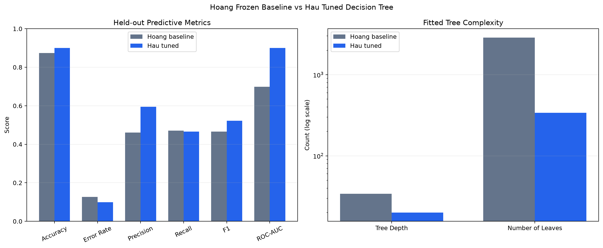
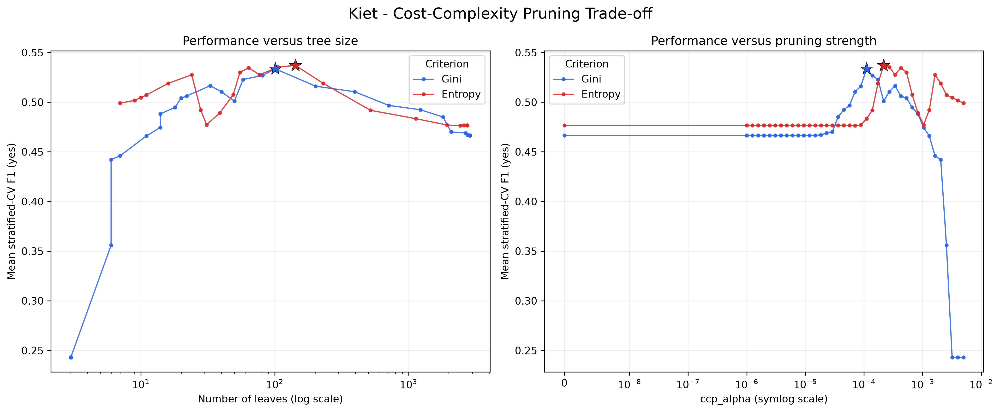
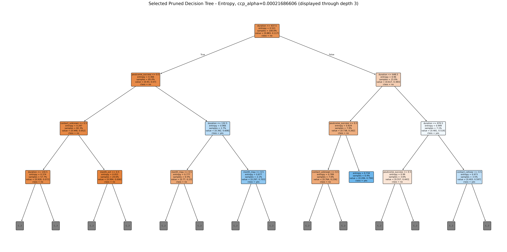
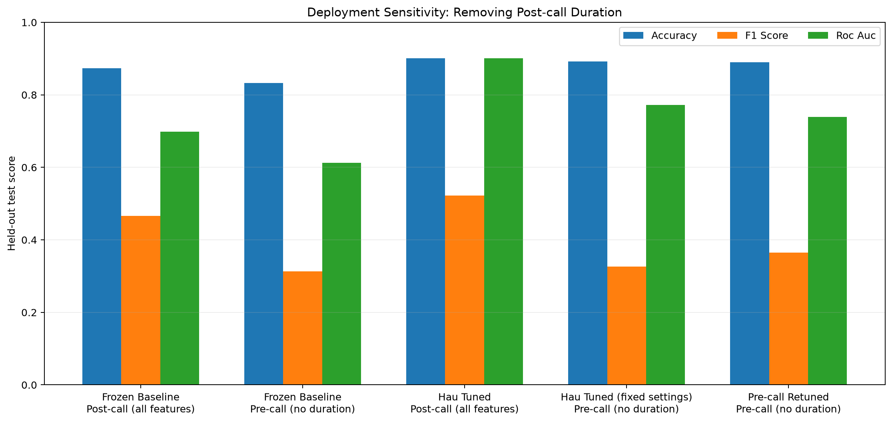

# Lab 2: Decision Tree Modeling and Improvement

## 1. Team Introduction

This project was completed by Group 1, consisting of five members. The member names, student IDs, and responsibilities are shown below.

| Member | Student ID | Main contribution |
| --- | --- | --- |
| Phùng Bảo Khang | 24127052 | Dataset validation, exploratory data analysis, target encoding, preprocessing, and the shared train/test split |
| Nguyễn Huy Hoàng | 24127378 | Frozen baseline model, evaluation, tree visualization, feature importance, and decision-rule analysis |
| Nguyễn Đăng Hậu | 24127167 | Training-only cross-validation for `max_depth`, `min_samples_split`, and `min_samples_leaf` |
| Thái Kiệt | 24127069 | Cost-complexity pruning, `ccp_alpha` selection, and Gini-versus-Entropy analysis |
| Nguyễn Thành Trung | 24127257 | Class-weight experiment, model comparison, and team conclusion |

**Group ID:** 1

## 2. Problem Introduction

A Decision Tree is a supervised learning model that recursively divides observations into increasingly homogeneous groups. At each internal node, the algorithm selects a feature and threshold that reduce class impurity. A path from the root to a leaf forms an explicit decision rule, which makes the model easier to inspect than many black-box alternatives. However, an unrestricted tree can grow branches around noise and rare observations, fit the training data nearly perfectly, and generalize poorly.

This project applies Decision Tree classification to the Bank Marketing dataset. The task is to predict whether a client of a Portuguese banking institution will subscribe to a term deposit after a direct-marketing campaign. The work has four technical aims: build a reproducible baseline, evaluate it with metrics appropriate for an imbalanced classification problem, interpret its structure and rules, and test three distinct improvement strategies. A separate controlled sensitivity analysis removes the post-call `duration` feature to examine whether the official results transfer to a realistic pre-call setting; this diagnostic is not counted as a fourth improvement method.

## 3. Project Goals and Acceptance Criteria

The following goals and criteria were derived from all six pages of the course handout. They are used both as the experiment specification and as the checklist for reviewing the source code.

| Goal | Acceptance criteria |
| --- | --- |
| G1 — Select and describe a valid dataset | Use a reliable public source; report the source, sample count, feature count, target classes, and why the task is suitable for a Decision Tree. |
| G2 — Build a leakage-safe data pipeline | Validate the input schema; separate the target from predictors; create reproducible training and test partitions; fit preprocessing only on training data; retain the same split for every model. |
| G3 — Establish a true baseline | Train one untuned Decision Tree; state its exact configuration; preserve it unchanged while improvement methods are evaluated. |
| G4 — Evaluate the classifier | Report at least Accuracy and Error Rate; for this imbalanced task also report the Confusion Matrix, positive-class Precision, Recall, F1-score, and ROC-AUC. |
| G5 — Interpret the resulting tree | Present the tree, describe its depth and size, explain important early splits and representative rules, and diagnose underfitting or overfitting. |
| G6 — Implement two or three improvements | Implement each method separately; select its settings without using the official test set; report the modified configuration, Accuracy, Error Rate, other relevant metrics, and why the result improved or did not improve. |
| G7 — Compare and select models | Compare the baseline with the official improved models on the same held-out partition; state the evaluation priority; identify the best method and explain its trade-offs. |
| G8 — Make the work reproducible | Provide organized and commented source code for data loading, preprocessing, training, evaluation, and visualization; expose a runnable entry point; generate traceable artifacts; and pass automated checks. |

The handout separately requires a final ZIP package, a PDF version of the report, and a presentation video or link. Those submission deliverables are course instructions, not additional requirements introduced by this report rewrite.

## 4. Dataset Description

### 4.1. Source and Prediction Task

The Bank Marketing dataset was created by Paulo Cortez and Sergio Moro and is distributed through the UCI Machine Learning Repository. It describes telephone-based direct-marketing campaigns conducted by a Portuguese banking institution between May 2008 and November 2010. The classification target `y` records whether a client subscribed to a term deposit.

The repository uses the complete semicolon-delimited file `data/bank-full.csv`.

| Property | Value |
| --- | ---: |
| Observations | 45,211 |
| Input features | 16 |
| Numerical features | 7 |
| Categorical features | 9 |
| Target | `y` |
| Target classes | `no`, `yes` |
| True missing values (`NaN`) | 0 |
| Fully duplicated rows | 0 |

The seven numerical predictors are `age`, `balance`, `day`, `duration`, `campaign`, `pdays`, and `previous`. The nine categorical predictors are `job`, `marital`, `education`, `default`, `housing`, `loan`, `contact`, `month`, and `poutcome`.

The dataset is suitable for Decision Tree modeling because it contains a binary target, both numerical and categorical predictors, nonlinear relationships, and plausible feature interactions. After one-hot encoding, a tree can divide the feature space without requiring numerical scaling.

### 4.2. Class Distribution

| Class | Encoded value | Count | Share |
| --- | ---: | ---: | ---: |
| `no` | 0 | 39,922 | 88.3015% |
| `yes` | 1 | 5,289 | 11.6985% |


The majority class is approximately 7.55 times as frequent as the positive `yes` class. Therefore, Accuracy alone is insufficient: a useful comparison must also consider positive-class Precision, Recall, F1-score, and ROC-AUC.

### 4.3. Preprocessing and Split

The shared data contract performs the following steps:

1. Validate the exact 17-column schema and the two allowed target labels.
2. Remove `y` from the predictor matrix and map `no` to 0 and `yes` to 1.
3. Create a shuffled, stratified 80%/20% split with `random_state=42`.
4. Fit `OneHotEncoder(handle_unknown="ignore")` on the training partition only.
5. Pass the seven numerical features through without scaling.

| Partition | Rows | `no` | `yes` | Transformed shape |
| --- | ---: | ---: | ---: | ---: |
| Training | 36,168 | 31,937 | 4,231 | 36,168 x 51 |
| Test | 9,043 | 7,985 | 1,058 | 9,043 x 51 |


The original indices are retained for auditability. The training and test indices are disjoint, and every experiment reconstructs the same two fingerprints. Cross-validated methods place preprocessing inside the model pipeline so the encoder is refitted independently inside each training fold.

## 5. Experimental Methodology

### 5.1. Evaluation Metrics

All final model scores are computed on the same untouched 9,043-row test partition. The positive class is `yes`.

- **Accuracy** is the proportion of all correct predictions.
- **Error Rate** is `1 - Accuracy`.
- **Precision** is the proportion of predicted subscriptions that are correct.
- **Recall** is the proportion of actual subscriptions detected.
- **F1-score** is the harmonic mean of Precision and Recall.
- **ROC-AUC** evaluates probability ranking across classification thresholds. The implementation uses the positive-class output of `predict_proba`, not hard class predictions.

Because the data is imbalanced, positive-class F1 is the primary predictive metric in the overall discussion. Accuracy and Error Rate remain mandatory lab metrics, while model size and ROC-AUC are secondary criteria.

### 5.2. Experiment Control

All methods share the same dataset, target mapping, split, preprocessing rules, and `random_state=42`. The baseline parameters are stored in an immutable mapping. Improvement methods build their own estimators rather than mutating the baseline. Candidate settings are selected only from training data; the test partition is used after selection for final evaluation.

Every comparable artifact now includes a canonical experiment identity containing the dataset SHA-256 hash, ordered training and test index fingerprints, test ratio, random seed, and target mapping. The unified runner passes earlier results to the comparison stage directly in memory. If the class-weight workflow is run independently, it validates all loaded baseline, tuning, and pruning identities and rejects missing or stale artifacts before constructing the final comparison.

## 6. Baseline Model

### 6.1. Configuration

The baseline is an untuned `DecisionTreeClassifier` with Gini impurity, the best splitter, unlimited depth, `min_samples_split=2`, `min_samples_leaf=1`, no class weighting, and `ccp_alpha=0`. All constructor settings are explicitly frozen in `src/experiment_contract.py` so changes in library defaults cannot silently redefine the reference model.

### 6.2. Results

| Metric | Baseline result |
| --- | ---: |
| Accuracy | 0.873714 |
| Error Rate | 0.126286 |
| Precision (`yes`) | 0.461111 |
| Recall (`yes`) | 0.470699 |
| F1-score (`yes`) | 0.465856 |
| ROC-AUC | 0.698906 |
| Training Accuracy | 1.000000 |
| Test Accuracy | 0.873714 |
| Train-test Accuracy gap | 0.126286 |

The test Confusion Matrix, ordered as `no`, `yes`, is `[[7403, 582], [560, 498]]`. Thus, the baseline produces 7,403 true negatives, 582 false positives, 560 false negatives, and 498 true positives.


An always-`no` classifier would achieve 0.883003 Accuracy on this test set, which is higher than the baseline. However, it would detect no subscriptions. This comparison reinforces why the positive-class metrics are required.

## 7. Analysis of the Resulting Tree

### 7.1. Structure and Overfitting

The fitted baseline has depth 34, 5,751 nodes, and 2,876 leaves. Its perfect training Accuracy and much lower test Accuracy produce a gap of 0.126286. This is strong evidence that the unrestricted tree has learned highly specific training patterns and is overfitting.


The full structure is too large to label legibly in one image, so a second visualization presents only the top levels of the same fitted model. It is a display truncation, not a retrained tree.


### 7.2. Important Splits and Decision Rules

The root split is `duration <= 521.5`. The first levels then use `poutcome_success`, additional `duration` thresholds, and `contact_cellular`. These splits are plausible: longer calls and a successful outcome in a previous campaign are associated with a higher probability of subscription.

| Depth | Path | Split feature | Threshold | Training rows | Node prediction |
| ---: | --- | --- | ---: | ---: | --- |
| 0 | `root` | `duration` | 521.5 | 36,168 | `no` |
| 1 | `rootL` | `poutcome_success` | 0.5 | 32,180 | `no` |
| 2 | `rootLL` | `duration` | 205.5 | 31,145 | `no` |
| 2 | `rootLR` | `duration` | 132.5 | 1,035 | `yes` |
| 1 | `rootR` | `duration` | 827.5 | 3,988 | `no` |
| 2 | `rootRL` | `poutcome_success` | 0.5 | 2,540 | `no` |
| 2 | `rootRR` | `contact_cellular` | 0.5 | 1,448 | `yes` |

Representative learned rules include the following:

- A client with `duration > 827.5`, cellular contact, age at most 54.5, a successful previous campaign, and contact day above 8 is assigned to a pure `yes` training leaf. Five held-out rows follow this exact path, with observed purity 0.600.
- A selected `yes` rule with `521.5 < duration <= 827.5`, previous-campaign success, no housing loan, and additional conditions has 55 training rows at purity 1.000; its 21 matching held-out rows have purity 0.810.
- The two selected `no` rules have held-out supports of 23 and 7, with purities 1.000 and 0.714 respectively.

These audits show that training-leaf purity does not automatically transfer to unseen rows. The paths describe associations in the fitted model; they are not causal statements. Full per-rule support and purity are stored in `outputs/trees/representative_rules_audit.json`.

### 7.3. Feature Importance

| Rank | Feature | Impurity-based importance |
| ---: | --- | ---: |
| 1 | `duration` | 0.276517 |
| 2 | `balance` | 0.103049 |
| 3 | `poutcome_success` | 0.091619 |
| 4 | `age` | 0.087798 |
| 5 | `day` | 0.084751 |
| 6 | `pdays` | 0.045028 |
| 7 | `campaign` | 0.030971 |
| 8 | `housing_yes` | 0.017515 |
| 9 | `month_mar` | 0.014057 |
| 10 | `month_jun` | 0.013801 |


Impurity-based importance measures how much the fitted tree used a feature to reduce impurity. It does not establish causality and can favor variables that offer many possible split points.

## 8. Improvement Methods

### 8.1. Method 1 — Structural Hyperparameter Tuning

This method constrains the tree using `max_depth`, `min_samples_split`, and `min_samples_leaf`. Candidate configurations were evaluated by positive-class F1 using shuffled stratified five-fold cross-validation on the official training partition. Preprocessing was fitted within every fold. A 216-combination grid selected:

```text
max_depth=20
min_samples_split=100
min_samples_leaf=10
mean validation F1=0.524293
```

| Metric | Baseline | Tuned tree | Change |
| --- | ---: | ---: | ---: |
| Accuracy | 0.873714 | 0.900476 | +0.026761 |
| Error Rate | 0.126286 | 0.099524 | -0.026761 |
| Precision (`yes`) | 0.461111 | 0.595411 | +0.134300 |
| Recall (`yes`) | 0.470699 | 0.465974 | -0.004726 |
| F1-score (`yes`) | 0.465856 | 0.522800 | +0.056944 |
| ROC-AUC | 0.698906 | 0.900540 | +0.201634 |
| Depth | 34 | 20 | -14 |
| Leaves | 2,876 | 339 | -2,537 |



The method improves generalization because it prevents small, highly specific branches. Accuracy, Error Rate, Precision, F1, ROC-AUC, and tree size all improve substantially. Recall decreases slightly, so the result is not an unconditional improvement for every possible business objective.

### 8.2. Method 2 — Cost-Complexity Pruning and Split Criterion

Minimal cost-complexity pruning penalizes the number of leaves through `ccp_alpha`. For both Gini and Entropy, the code evaluates a fixed, label-independent geometric grid of 40 alpha values using stratified five-fold cross-validation on the complete official training partition. Preprocessing is inside each pipeline and is refitted within every fold. Both `criterion` and `ccp_alpha` are selected by positive-class F1; ties prefer higher Recall and then fewer leaves and nodes.

| Criterion | Selected `ccp_alpha` | Mean CV F1 | Std CV F1 | Mean CV Recall | Full-train leaves |
| --- | ---: | ---: | ---: | ---: | ---: |
| Gini | 0.00011070510 | 0.533551 | 0.024223 | 0.486897 | 101 |
| Entropy | 0.00021686606 | **0.536994** | 0.016560 | **0.491145** | 143 |

Entropy was locked as the official pruning criterion because it had the higher mean CV F1 and Recall. Both per-criterion alphas were then refitted on the full training partition and evaluated once on the test partition.

| Model | Accuracy | Error Rate | Precision (`yes`) | Recall (`yes`) | F1 (`yes`) | ROC-AUC | Depth | Leaves |
| --- | ---: | ---: | ---: | ---: | ---: | ---: | ---: | ---: |
| Unpruned Gini baseline | 0.873714 | 0.126286 | 0.461111 | 0.470699 | 0.465856 | 0.698906 | 34 | 2,876 |
| Unpruned Entropy | 0.883335 | 0.116665 | 0.501463 | 0.485822 | 0.493519 | 0.710914 | 37 | 2,744 |
| Pruned Gini | 0.900476 | 0.099524 | 0.597291 | 0.458412 | 0.518717 | 0.906732 | 18 | 101 |
| Pruned Entropy | **0.904456** | **0.095544** | **0.603632** | **0.534026** | **0.566700** | **0.911403** | 19 | 143 |



The official Pruned Entropy tree raises Accuracy by 0.030742 and reduces Error Rate by the same amount. It removes 95.03% of the baseline leaves and reduces the train-test Accuracy gap from 0.126286 to 0.007399. Its stronger test scores are consistent with its training-CV selection; no post-hoc switch was made after viewing the test set.



### 8.3. Method 3 — Class Weighting

The third method addresses the minority `yes` class directly while avoiding the unrestricted tree's structural overfitting. Hau's training-CV-selected controls (`max_depth=20`, `min_samples_split=100`, and `min_samples_leaf=10`) are fixed before the weight search. Seven weights (`None`, `balanced`, and positive-class weights from 1.5 to 5) are then compared by positive-class F1 using a new stratified five-fold CV pass on training data. Ties are resolved by Recall and then original candidate order.

The selected weight was `{no: 1.0, yes: 3.0}`, with mean CV F1 of 0.584174 and mean CV Recall of 0.740488.

| Metric | Baseline | Weighted + tuned tree | Change |
| --- | ---: | ---: | ---: |
| Accuracy | 0.873714 | 0.880128 | +0.006414 |
| Error Rate | 0.126286 | 0.119872 | -0.006414 |
| Precision (`yes`) | 0.461111 | 0.491975 | +0.030864 |
| Recall (`yes`) | 0.470699 | 0.753308 | +0.282609 |
| F1-score (`yes`) | 0.465856 | 0.595220 | +0.129364 |
| ROC-AUC | 0.698906 | 0.894534 | +0.195628 |
| Depth | 34 | 20 | -14 |
| Leaves | 2,876 | 390 | -2,486 |


Combining weighting with fixed structural regularization produces the highest positive-class Recall and F1 among the official methods. Training Accuracy is 0.894078, the train-test gap is only 0.013949, and the tree has 390 leaves rather than 2,876. Accuracy is lower than the structurally tuned and pruned alternatives, which is the expected trade-off for detecting many more positive cases.


## 9. Comparison and Discussion

The official team comparison contains one training-CV-selected model for each method. Positive-class F1 is the declared primary selection metric for all three improvements.

<!-- BEGIN AUTO-GENERATED TEAM COMPARISON -->
| Official model | Accuracy | Error Rate | Precision (`yes`) | Recall (`yes`) | F1 (`yes`) | ROC-AUC | Depth | Leaves | Nodes |
| --- | ---: | ---: | ---: | ---: | ---: | ---: | ---: | ---: | ---: |
| Hoang Baseline | 0.873714 | 0.126286 | 0.461111 | 0.470699 | 0.465856 | 0.698906 | 34 | 2,876 | 5,751 |
| Hau Tuned | 0.900476 | 0.099524 | 0.595411 | 0.465974 | 0.522800 | 0.900540 | 20 | 339 | 677 |
| Kiet Pruned Entropy | 0.904456 | 0.095544 | 0.603632 | 0.534026 | 0.566700 | 0.911403 | 19 | 143 | 285 |
| Trung Weighted + Tuned | 0.880128 | 0.119872 | 0.491975 | 0.753308 | 0.595220 | 0.894534 | 20 | 390 | 779 |
<!-- END AUTO-GENERATED TEAM COMPARISON -->


The result depends on the evaluation priority:

- Trung's weighted + tuned tree has the highest positive-class F1 (0.595220) and Recall (0.753308), matching the declared primary objective.
- Kiet's Pruned Entropy tree has the best Accuracy (0.904456), lowest Error Rate (0.095544), highest Precision (0.603632), highest ROC-AUC (0.911403), and the smallest improved tree at 143 leaves.
- Hau's tuned tree remains a strong middle ground, but both its F1 and Accuracy are below the pruning result on the held-out partition.
- The final choice therefore depends on whether missed subscribers or false-positive calls are more costly; the report does not hide this operational trade-off.

For this lab, **Trung Weighted + Tuned is the final recommended official model** because F1 for the minority `yes` class was declared as the primary metric before model selection. Pruned Entropy is the recommended alternative when Accuracy, ROC-AUC, or compact interpretability has higher priority.

### 9.1. Statistical Uncertainty

The table below is generated from 2,000 paired stratified bootstrap resamples of the common held-out rows. These intervals quantify sampling uncertainty; they do not replace training-only model selection.

<!-- BEGIN AUTO-GENERATED UNCERTAINTY -->
| Model | Metric | Point estimate | 95% CI |
| --- | --- | ---: | ---: |
| Hoang Baseline | Accuracy | 0.873714 | [0.868075, 0.880239] |
| Hoang Baseline | F1 Score | 0.465856 | [0.442984, 0.491621] |
| Hau Tuned | Accuracy | 0.900476 | [0.895057, 0.905894] |
| Hau Tuned | F1 Score | 0.522800 | [0.495151, 0.550556] |
| Kiet Pruned Entropy | Accuracy | 0.904456 | [0.898817, 0.909764] |
| Kiet Pruned Entropy | F1 Score | 0.566700 | [0.540675, 0.592043] |
| Trung Weighted + Tuned | Accuracy | 0.880128 | [0.873272, 0.886321] |
| Trung Weighted + Tuned | F1 Score | 0.595220 | [0.576631, 0.612812] |
<!-- END AUTO-GENERATED UNCERTAINTY -->

The paired F1 difference between Kiet Pruned Entropy and Trung Weighted + Tuned is -0.028520, with a 95% interval of [-0.051429, -0.005997]. Because this interval excludes zero, the held-out evidence supports the hybrid model's F1 advantage under this bootstrap design. This is conditional on the fixed test partition and is not a claim about every future campaign.

## 10. Pre-call Duration Sensitivity Analysis

The official dataset contains `duration`, which is known only after a marketing call has ended. To quantify this deployment limitation, the code first performs a controlled ablation on the same official split by holding the baseline and Hau settings fixed. It then repeats Hau's complete 216-combination, five-fold training-CV search after removing `duration`. The pre-call schema contains 15 raw predictors and 50 transformed features.

<!-- BEGIN AUTO-GENERATED PRECALL COMPARISON -->
| Configuration | Feature set | Accuracy | Error Rate | Precision (`yes`) | Recall (`yes`) | F1 (`yes`) | ROC-AUC | Depth | Leaves |
| --- | --- | ---: | ---: | ---: | ---: | ---: | ---: | ---: | ---: |
| Frozen Baseline | Post-call (all features) | 0.873714 | 0.126286 | 0.461111 | 0.470699 | 0.465856 | 0.698906 | 34 | 2,876 |
| Frozen Baseline | Pre-call (no duration) | 0.832909 | 0.167091 | 0.301490 | 0.325142 | 0.312869 | 0.612665 | 47 | 4,769 |
| Hau Tuned | Post-call (all features) | 0.900476 | 0.099524 | 0.595411 | 0.465974 | 0.522800 | 0.900540 | 20 | 339 |
| Hau Tuned (fixed settings) | Pre-call (no duration) | 0.891850 | 0.108150 | 0.601523 | 0.224008 | 0.326446 | 0.771819 | 20 | 397 |
| Pre-call Retuned | Pre-call (no duration) | 0.889417 | 0.110583 | 0.556202 | 0.271267 | 0.364676 | 0.738753 | 33 | 1,000 |
<!-- END AUTO-GENERATED PRECALL COMPARISON -->



Removing `duration` reduces baseline Accuracy by 0.040805 and F1 by 0.152986. With Hau's fixed structural settings, Accuracy falls by only 0.008625, but positive-class F1 falls by 0.196353 because Recall decreases from 0.465974 to 0.224008. The result confirms that post-call `duration` contains substantial information about subscriptions, particularly for detecting positive cases.

Fresh pre-call tuning selected `max_depth=None`, `min_samples_split=50`, and `min_samples_leaf=10` with mean CV F1 0.352679. Its held-out F1 is 0.364676, improving by 0.038230 over the fixed Hau settings through higher Recall, although Accuracy and ROC-AUC are lower. The test set was not used for this choice. Thus the report provides both a controlled feature ablation and the best duration-free model found within the declared search space.

## 11. Source-Code Verification

### 11.1. Verification Results

The complete Python source, tests, notebooks, generated tables, and experiment artifacts were reviewed against goals G1–G8. The current source was executed end to end, regenerating all official results, experiment identities, and the separate pre-call sensitivity artifacts.

| Goal | Status | Evidence |
| --- | --- | --- |
| G1 — Dataset validity | Pass | `src/data.py` validates schema, target, dtypes, finite values, categorical domains, numerical constraints, unique indices, and duplicate rows; the source CSV has 45,211 rows and 16 predictors. |
| G2 — Leakage-safe pipeline | Pass | The target is excluded; indices are disjoint; preprocessing is fit on training data; cross-validation uses a combined preprocessing/model pipeline; all workflows reproduce the same split fingerprints and reject incompatible artifacts. |
| G3 — Frozen baseline | Pass | `FROZEN_BASELINE_PARAMETERS` is immutable; baseline tests verify its exact configuration; improvement modules construct separate estimators. |
| G4 — Evaluation | Pass | Accuracy, Error Rate, Precision, Recall, F1, ROC-AUC, classification reports, and Confusion Matrices are generated. ROC-AUC uses positive-class probabilities. |
| G5 — Tree interpretation | Pass | The code exports the full DOT tree, structural/readable figures, early splits, representative rules with held-out support/purity audits, feature importance, and complexity statistics. |
| G6 — Three improvements | Pass | Structural tuning, F1-CV cost-complexity pruning/criterion comparison, and structurally regularized class weighting are implemented with training-only selection and final held-out results. |
| G7 — Fair comparison | Pass | Official models use the same dataset, target, preprocessing contract, test split, and metrics. Results are passed in memory by the unified runner; standalone artifact loading validates the complete experiment identity. |
| G8 — Reproducibility | Pass | `run_all.py` reproduces the workflow; exact dependencies are locked; tuned pipelines are saved; generated report blocks are tested against artifacts; 45 automated tests pass. |

### 11.2. Commands Used for Verification

```bash
.venv/bin/python -m unittest discover -s tests -v
.venv/bin/python -m compileall -q src run_all.py tests
.venv/bin/python -m pip check
.venv/bin/python run_all.py
```

The test result was **45 passed, 0 failed, 0 errors**. The end-to-end run completed successfully and reproduced the four official model Accuracy values exactly:

- Baseline: 0.8737144753
- Tuned: 0.9004755059
- Pruned Entropy: 0.9044564857
- Weighted + tuned: 0.8801282760

The three committed notebooks are consolidated under `notebooks/`, have execution counts, and contain no stored error output. Shared metrics and confusion-matrix logic live in `src/evaluation.py`; tree-specific training and interpretation remain in `src/baseline_tree.py`. The obsolete empty `src/evaluate.py` placeholder was removed.

### 11.3. Implemented Robustness Corrections

The audit findings were resolved as follows:

1. Comparable model artifacts now store and validate a shared experiment identity. Tests prove that a mismatched dataset hash or split fingerprint is rejected.
2. The class-weight selector runs before plotting and passes its exact `candidate_order` to the figure. The marker therefore follows the same F1, Recall, and candidate-order tie-break policy even when the DataFrame index is non-contiguous.
3. The unused evaluation placeholder was replaced by a real shared `src/evaluation.py` module consumed by baseline, pruning, pre-call, and class-weight workflows.
4. Pruning selects both alpha and criterion by positive-class F1 under stratified five-fold CV over a fixed label-independent grid.
5. The pre-call pipeline now includes both a fixed-configuration ablation and a complete duration-free retuning pass.
6. Class weighting is combined with structural controls fixed by training CV, eliminating the unrestricted weighted tree's overfitting.
7. A 2,000-replicate paired stratified bootstrap quantifies Accuracy and F1 uncertainty and paired F1 differences.
8. Exact dependencies are locked, Hau's fitted pipeline is persisted, and protected report tables are regenerated from CSV artifacts with a stale-report regression test.

## 12. Limitations

The most important limitation is the feature `duration`. It measures call duration and is known only after a call ends. It is valid for the official post-call experiment, but it would be unavailable to a system deciding whom to call in advance. The controlled ablation demonstrates a material loss in positive-class F1 when it is removed. This is a deployment-time feature-availability issue, not train/test leakage in the implemented pipeline.

Other limitations include class imbalance, reliance on one official held-out partition for final point estimates, and impurity-based feature importance. The paired bootstrap quantifies uncertainty conditional on this test partition, but it does not capture variation from retraining on entirely new samples. The pre-call result is optimized only within the declared Decision Tree grid. Future work should use nested or repeated cross-validation, select thresholds from explicit business costs, calibrate probabilities, and validate on a later campaign.

## 13. Conclusion

This project built and interpreted a Decision Tree classifier for the UCI Bank Marketing dataset and evaluated three improvement strategies under a shared, leakage-safe experiment contract. The unrestricted baseline overfit severely: it reached 1.0 training Accuracy, only 0.873714 test Accuracy, and contained 2,876 leaves.

All three improvements use positive-class F1 for training-only selection. Pruned Entropy achieves the best Accuracy (0.904456), Error Rate (0.095544), ROC-AUC (0.911403), and compactness (143 leaves). The weighted + tuned tree achieves the best F1 (0.595220) and Recall (0.753308), with a paired-bootstrap F1 advantage over pruning whose 95% interval excludes zero. It is therefore the final recommendation under the declared primary metric, while Pruned Entropy is the best accuracy-oriented and most interpretable alternative. Fresh duration-free tuning improves pre-call F1 over the fixed-settings ablation but remains materially below the post-call models, so post-call performance must not be presented as pre-call targeting performance.

The results demonstrate both strengths and weaknesses of Decision Trees. They are transparent, flexible, and easy to express as rules, but unrestricted growth is unstable and prone to memorization. Careful validation, explicit regularization, honest metric selection, and awareness of feature availability are essential for a defensible model.

## 14. References

1. Introduction to Artificial Intelligence course. *Lab 2: Decision Tree Modeling and Improvement*. Course assignment handout, 2026.
2. Moro, S., Laureano, R., & Cortez, P. (2011). “Using Data Mining for Bank Direct Marketing: An Application of the CRISP-DM Methodology.” *Proceedings of the European Simulation and Modelling Conference*, 117–121. <http://hdl.handle.net/1822/14838>
3. Cortez, P., & Moro, S. (2012). *Bank Marketing* [Dataset]. UCI Machine Learning Repository. <https://archive.ics.uci.edu/dataset/222/bank+marketing>
4. scikit-learn developers. *Decision Trees — User Guide*. <https://scikit-learn.org/stable/modules/tree.html>
5. scikit-learn developers. *DecisionTreeClassifier API Reference*. <https://scikit-learn.org/stable/modules/generated/sklearn.tree.DecisionTreeClassifier.html>
6. scikit-learn developers. *Metrics and Scoring: Quantifying the Quality of Predictions*. <https://scikit-learn.org/stable/modules/model_evaluation.html>
7. pandas development team. *pandas Documentation*. <https://pandas.pydata.org/docs/>
8. Matplotlib development team. *Matplotlib Documentation*. <https://matplotlib.org/stable/>
9. Project dataset metadata and citation request: [`data/bank-names.txt`](data/bank-names.txt).
