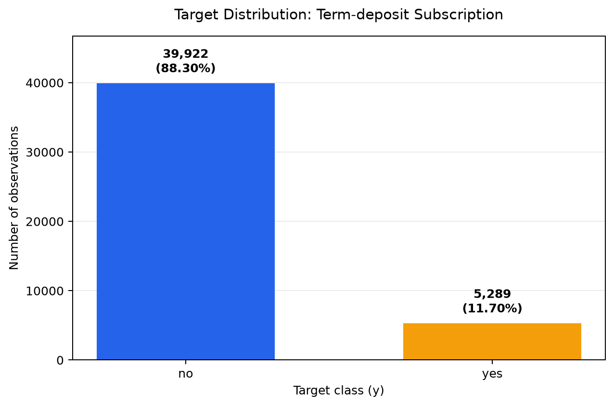
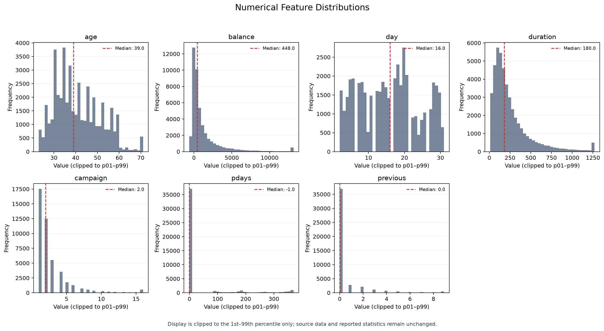
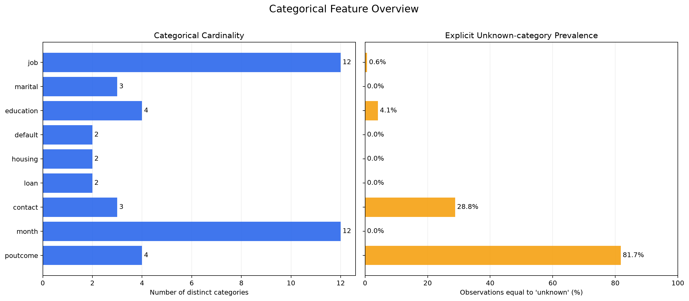
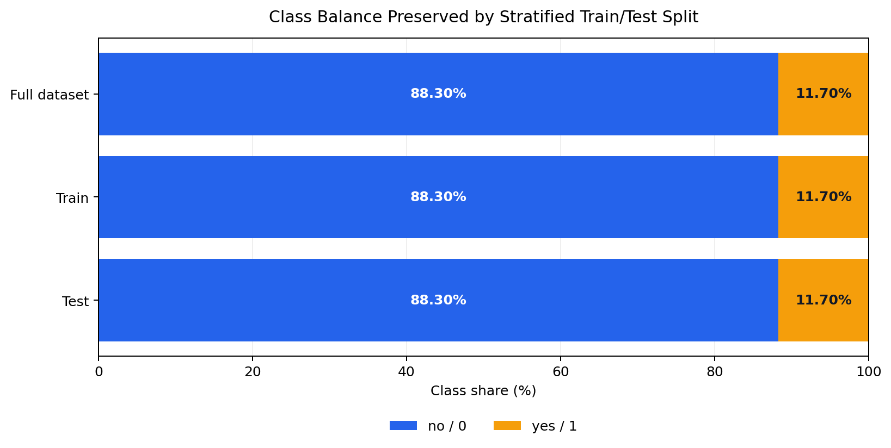

# Phần 1 — Khang: Dataset, EDA và tiền xử lý dùng chung

## 1. Phạm vi thực hiện

Phần này thực hiện bốn nhiệm vụ:

1. đọc và kiểm tra cấu trúc `data/bank-full.csv`;
2. thực hiện EDA cho dữ liệu, biến số, biến phân loại và biến mục tiêu;
3. mã hóa categorical features và target;
4. chia train/test bằng stratified sampling, sau đó đóng gói tiền xử lý thành
   pipeline dùng chung cho cả nhóm.

Mọi số liệu trong tài liệu này được sinh trực tiếp trong workflow duy nhất bằng
`python run_all.py`. Mã nguồn tương ứng nằm trong `src/data.py`, `src/eda.py`,
`src/preprocessing.py` và `src/visualization.py`.

## 2. Dataset Description

### 2.1. Nguồn và bài toán

Bank Marketing dataset được tạo bởi Paulo Cortez (University of Minho) và
Sérgio Moro (ISCTE-IUL), công bố năm 2012. Dữ liệu liên quan đến các chiến dịch
tiếp thị trực tiếp bằng điện thoại của một ngân hàng Bồ Đào Nha trong khoảng từ
tháng 5/2008 đến tháng 11/2010. Một khách hàng có thể được liên hệ nhiều lần.

Bài toán phân loại là dự đoán khách hàng có đăng ký tiền gửi có kỳ hạn hay
không. Thông tin nguồn và trích dẫn gốc được lưu trong `data/bank-names.txt`.
Tệp đầy đủ `bank-full.csv` dùng dấu chấm phẩy (`;`) làm delimiter.

Trích dẫn được nhà cung cấp dữ liệu đề nghị:

> S. Moro, R. Laureano and P. Cortez (2011), “Using Data Mining for Bank Direct
> Marketing: An Application of the CRISP-DM Methodology,” Proceedings of the
> European Simulation and Modelling Conference — ESM'2011, pp. 117–121.
> Tài liệu: <http://hdl.handle.net/1822/14838>.

### 2.2. Quy mô và cấu trúc

| Thuộc tính | Kết quả |
|---|---:|
| Số mẫu | 45.211 |
| Tổng số cột | 17 |
| Số biến đầu vào | 16 |
| Biến số | 7 |
| Biến phân loại | 9 |
| Biến mục tiêu | `y` |
| Giá trị thiếu thực (`NaN`) | 0 |
| Dòng trùng hoàn toàn | 0 |

### 2.3. Ý nghĩa các biến

| Biến | Kiểu | Mô tả |
|---|---|---|
| `age` | Số | Tuổi khách hàng. |
| `job` | Phân loại | Nghề nghiệp. |
| `marital` | Phân loại | Tình trạng hôn nhân; `divorced` gồm ly hôn hoặc góa. |
| `education` | Phân loại | Trình độ học vấn. |
| `default` | Nhị phân | Có nợ tín dụng quá hạn hay không. |
| `balance` | Số | Số dư trung bình năm, đơn vị euro. |
| `housing` | Nhị phân | Có khoản vay mua nhà hay không. |
| `loan` | Nhị phân | Có khoản vay cá nhân hay không. |
| `contact` | Phân loại | Hình thức liên lạc. |
| `day` | Số | Ngày trong tháng của lần liên hệ gần nhất. |
| `month` | Phân loại | Tháng của lần liên hệ gần nhất. |
| `duration` | Số | Thời lượng cuộc gọi gần nhất, đơn vị giây. |
| `campaign` | Số | Số lần liên hệ trong chiến dịch hiện tại, gồm lần gần nhất. |
| `pdays` | Số | Số ngày từ lần liên hệ ở chiến dịch trước; `-1` là chưa từng liên hệ. |
| `previous` | Số | Số lần liên hệ trước chiến dịch hiện tại. |
| `poutcome` | Phân loại | Kết quả của chiến dịch tiếp thị trước. |
| `y` | Mục tiêu | Có đăng ký tiền gửi có kỳ hạn: `yes` hoặc `no`. |

## 3. Exploratory Data Analysis

### 3.1. Phân bố biến mục tiêu

| Nhãn gốc | Nhãn mã hóa | Số mẫu | Tỷ lệ |
|---|---:|---:|---:|
| `no` | 0 | 39.922 | 88,3015% |
| `yes` | 1 | 5.289 | 11,6985% |



Lớp `no` nhiều gấp khoảng 7,55 lần lớp `yes`. Vì dữ liệu mất cân bằng rõ rệt,
accuracy không nên là chỉ số duy nhất; các phần đánh giá sau cần quan tâm đến
precision, recall, F1 và ROC-AUC, đặc biệt cho lớp `yes`.

### 3.2. Tóm tắt biến số

| Biến | Min | Mean | Median | Max |
|---|---:|---:|---:|---:|
| `age` | 18 | 40,936 | 39 | 95 |
| `balance` | -8.019 | 1.362,272 | 448 | 102.127 |
| `day` | 1 | 15,806 | 16 | 31 |
| `duration` | 0 | 258,163 | 180 | 4.918 |
| `campaign` | 1 | 2,764 | 2 | 63 |
| `pdays` | -1 | 40,198 | -1 | 871 |
| `previous` | 0 | 0,580 | 0 | 275 |



Các chênh lệch lớn giữa mean, median và max ở `balance`, `duration`,
`campaign`, `pdays`, `previous` cho thấy phân bố lệch và có giá trị cực đoan.
Decision Tree không yêu cầu chuẩn hóa thang đo, nên các biến số được giữ nguyên.

`pdays=-1` mang ý nghĩa nghiệp vụ “chưa từng được liên hệ”, không phải missing
value và không được thay thế bằng mean/median.

Các histogram chỉ giới hạn hiển thị trong percentile 1–99 để phần phân bố dày
dễ đọc hơn. Việc cắt ngưỡng trực quan này không làm thay đổi dữ liệu nguồn, số
liệu báo cáo, ma trận mã hóa hoặc đầu vào của mô hình.

### 3.3. Biến phân loại

| Biến | Số category | Số giá trị `unknown` |
|---|---:|---:|
| `job` | 12 | 288 |
| `marital` | 3 | 0 |
| `education` | 4 | 1.857 |
| `default` | 2 | 0 |
| `housing` | 2 | 0 |
| `loan` | 2 | 0 |
| `contact` | 3 | 13.020 |
| `month` | 12 | 0 |
| `poutcome` | 4 | 36.959 |



Chuỗi `unknown` là một category được bộ dữ liệu cung cấp, không phải `NaN`.
Pipeline giữ lại category này để không tự suy diễn thông tin chưa biết. Đặc biệt,
`poutcome` có phần lớn giá trị `unknown`, phù hợp với việc nhiều khách hàng chưa
có kết quả chiến dịch trước.

### 3.4. Lưu ý về `duration`

`duration` là thời lượng của cuộc gọi gần nhất và chỉ có đầy đủ sau khi cuộc gọi
kết thúc. Nếu mục tiêu triển khai là dự đoán trước khi gọi, dùng biến này sẽ tạo
ra information leakage theo thời điểm. Các thí nghiệm trong lab hiện vẫn giữ đủ
16 biến để thống nhất với mô tả bài toán; báo cáo mô hình cần nêu rõ hạn chế này
hoặc chạy thêm một cấu hình bỏ `duration` nếu đánh giá theo kịch bản triển khai
thực tế.

## 4. Mã hóa categorical features

### 4.1. Phương pháp

- Target: ánh xạ `no → 0`, `yes → 1`.
- 9 categorical features: dùng
  `OneHotEncoder(handle_unknown="ignore")`.
- 7 numerical features: truyền thẳng, không scaling.
- Encoder chỉ được `fit` trên `X_train`, sau đó dùng cùng transformer để
  `transform` cả train và test. Cách này tránh data leakage.
- `handle_unknown="ignore"` giúp pipeline dự đoán được khi test hoặc dữ liệu mới
  xuất hiện category chưa từng thấy trong train.

Chín biến phân loại tạo tổng cộng 44 cột one-hot. Kết hợp với 7 biến số, ma trận
sau tiền xử lý có 51 đặc trưng.

| Ma trận | Kích thước trước mã hóa | Kích thước sau mã hóa |
|---|---:|---:|
| Train | 36.168 × 16 | 36.168 × 51 |
| Test | 9.043 × 16 | 9.043 × 51 |

`OneHotEncoder` sinh sparse matrix để tránh cấp phát không cần thiết khi số
category tăng. Tên đầy đủ của 51 đặc trưng có trong trường
`encoding.feature_names` do `run_all.py` in ra.

## 5. Stratified train/test split

Sử dụng `sklearn.model_selection.train_test_split` với:

```text
test_size=0.20
random_state=42
stratify=y
```

| Tập | Tổng mẫu | `no` / 0 | Tỷ lệ | `yes` / 1 | Tỷ lệ |
|---|---:|---:|---:|---:|---:|
| Train | 36.168 | 31.937 | 88,3018% | 4.231 | 11,6982% |
| Test | 9.043 | 7.985 | 88,3003% | 1.058 | 11,6997% |



Tỷ lệ hai lớp gần như không đổi giữa dữ liệu gốc, train và test. Chỉ số hàng của
hai tập không giao nhau, và tổng số hàng vẫn là 45.211. Split được tạo trong bộ
nhớ thay vì lưu thêm hai bản CSV, nhờ đó toàn bộ thành viên luôn tái tạo cùng dữ
liệu từ một nguồn duy nhất.

## 6. Pipeline dùng chung

`src/preprocessing.py` cung cấp:

- `build_preprocessor()`: trả về `ColumnTransformer` chưa fit;
- `build_preprocessing_pipeline()`: pipeline chỉ có bước tiền xử lý, dùng để
  kiểm tra EDA/encoding;
- `build_model_pipeline(estimator)`: gắn estimator của từng thí nghiệm sau cùng
  một bước tiền xử lý.

Ví dụ cho Decision Tree:

```python
from sklearn.tree import DecisionTreeClassifier

from src.data import load_and_split_data
from src.preprocessing import build_model_pipeline

split = load_and_split_data(test_size=0.20, random_state=42)
model = build_model_pipeline(
    DecisionTreeClassifier(random_state=42)
)
model.fit(split.X_train, split.y_train)
predictions = model.predict(split.X_test)
```

Việc đặt encoder và model trong cùng pipeline cũng bảo đảm khi chạy
cross-validation, encoder được fit lại riêng trong từng training fold thay vì
nhìn thấy validation fold.

## 7. Tái tạo kết quả

Sau khi cài dependency theo README, chạy tại thư mục gốc:

```bash
python run_all.py
```

Workflow in toàn bộ EDA, phân bố lớp của train/test, kích thước ma trận sau
encoding và danh sách tên đặc trưng dưới dạng JSON. Đồng thời, nó tái tạo bốn
hình PNG trong `outputs/figures/`, sau đó chạy baseline trên cùng split và
pipeline. Các biểu đồ EDA chỉ trực quan hóa thống kê thuộc phần Khang.

Có thể chọn thư mục hình khác hoặc bỏ qua bước sinh hình:

```bash
python run_all.py --figures-dir outputs/figures
python run_all.py --skip-figures
```
