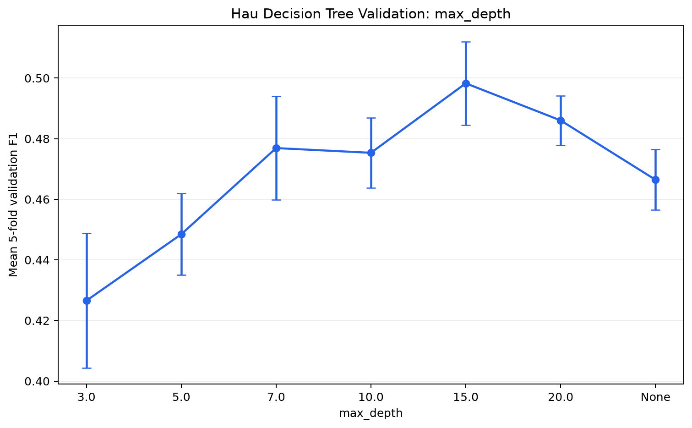
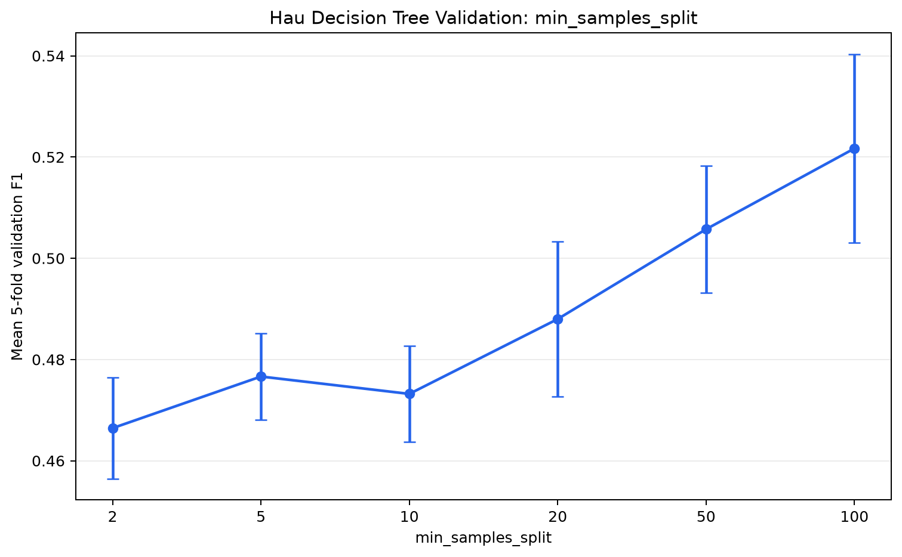
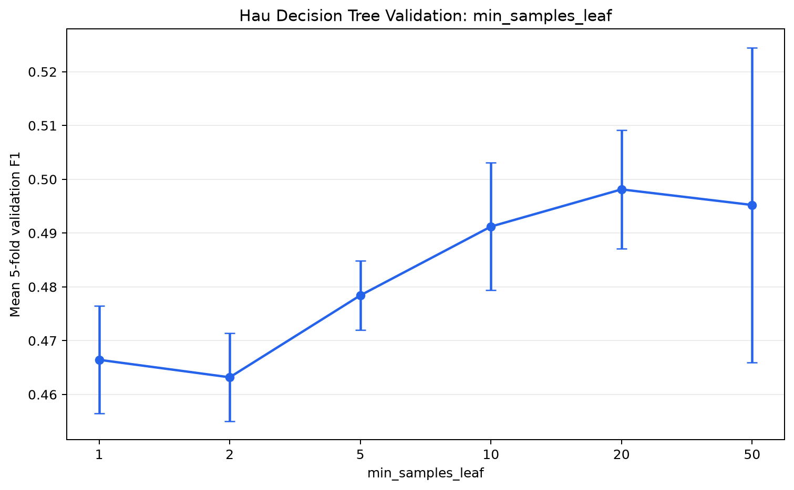

# Improvement Method 1 — Hyperparameter Tuning

## Experiment Contract and Selection Method

Hau's experiment reuses `data/bank-full.csv`, target `y` with `yes=1`, and the official stratified 80%/20% split with `random_state=42`. It uses `src.data.load_and_split_data()` and `src.preprocessing.build_model_pipeline()`, so one-hot preprocessing is fitted independently inside each training fold. The held-out test partition is not supplied to validation or model selection.

Candidate configurations are selected by positive-class F1 using shuffled stratified 5-fold cross-validation on the training partition. The selected pipeline is then refitted on all training rows and evaluated once on the official test partition. The combined search selected `max_depth=20`, `min_samples_split=100`, `min_samples_leaf=10`, with mean validation F1 **0.524293**.

The single-parameter validation ranges were:

- `max_depth`: `[3, 5, 7, 10, 15, 20, None]`
- `min_samples_split`: `[2, 5, 10, 20, 50, 100]`
- `min_samples_leaf`: `[1, 2, 5, 10, 20, 50]`

The combined search ranges were:

- `max_depth`: `[5, 7, 10, 15, 20, None]`
- `min_samples_split`: `[2, 5, 10, 20, 50, 100]`
- `min_samples_leaf`: `[1, 2, 5, 10, 20, 50]`

## Baseline Problem

Hoang's frozen baseline is an unrestricted Decision Tree. It can continue creating branches that fit noise or rare training patterns, increasing variance and causing overfitting. Hau's experiment does not modify or redefine that baseline.

## `max_depth`

`max_depth` limits how many split levels the tree can grow. A smaller depth reduces model complexity and variance and can improve generalization; a value that is too small can remove useful interactions and underfit.

## `min_samples_split`

`min_samples_split` is the minimum number of observations required before an internal node may split. Increasing it prevents very small nodes from creating highly specific branches and can reduce overfitting.

## `min_samples_leaf`

`min_samples_leaf` is the minimum number of observations allowed in every leaf. Increasing it prevents leaves supported by only a few observations, makes predictions less sensitive to individual training cases, and smooths the learned decision boundary.

## Cross-validation

Cross-validation estimates how candidate configurations generalize without consuming the official test set for model selection. Because preprocessing is part of the model pipeline, each fold learns its encoder only from that fold's training rows and transforms its validation rows without refitting.

## Frozen Baseline vs Hau Tuned Tree

| Metric | Baseline | Hau Tuned | Difference |
| --- | ---: | ---: | ---: |
| Accuracy | 0.873714 | 0.900476 | +0.026761 |
| Error Rate | 0.126286 | 0.099524 | -0.026761 |
| Precision | 0.461111 | 0.595411 | +0.134300 |
| Recall | 0.470699 | 0.465974 | -0.004726 |
| F1 | 0.465856 | 0.522800 | +0.056944 |
| ROC-AUC | 0.698906 | 0.900540 | +0.201634 |
| Tree Depth | 34 | 20 | -14 |
| Number of Leaves | 2876 | 339 | -2537 |

## Final Conclusion

On the untouched test set, Error rate decreased by 0.026761. Accuracy increased by 0.026761; Precision increased by 0.134300; Recall decreased by 0.004726; F1 increased by 0.056944; ROC-AUC increased by 0.201634. Tree depth changed from 34 to 20, and leaves changed from 2876 to 339. The selected tree contains 677 total nodes.

These results must be read as a trade-off rather than an accuracy-only claim. F1 was the training-only selection criterion because `yes` is the minority class; recall, precision, and probability-based ROC-AUC show whether any accuracy change also helps subscription detection. A metric that decreased is reported directly rather than being hidden by gains elsewhere. Tuning can improve generalization by constraining high-variance branches, but the measured table above—not the method alone—determines whether this selected model is preferable for the project's goals.
