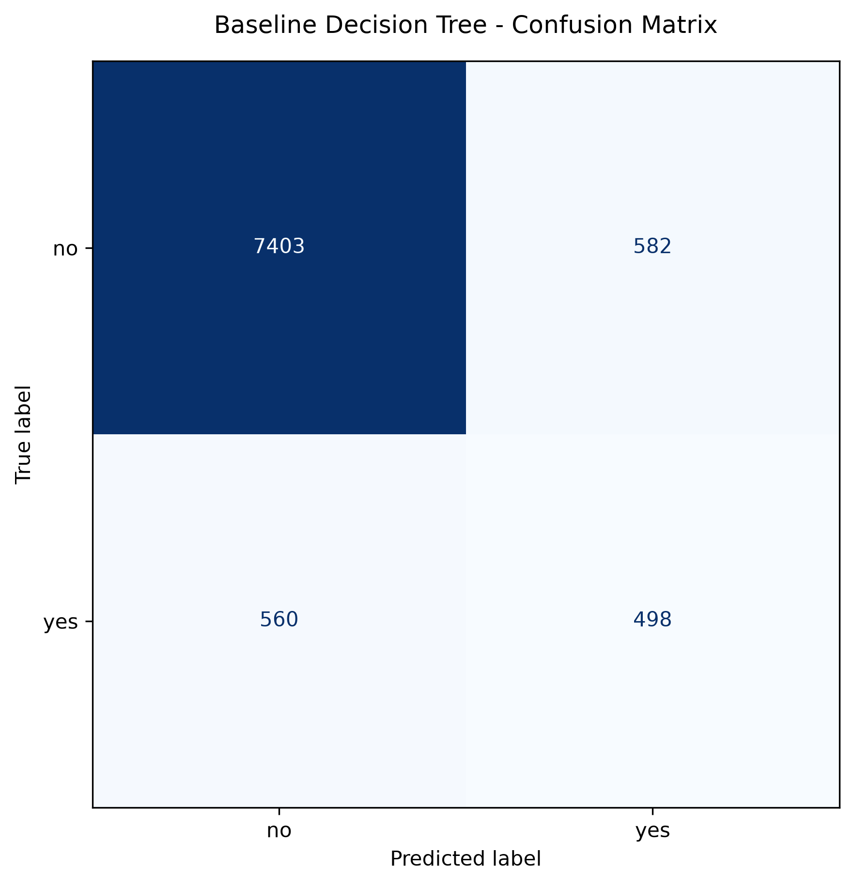
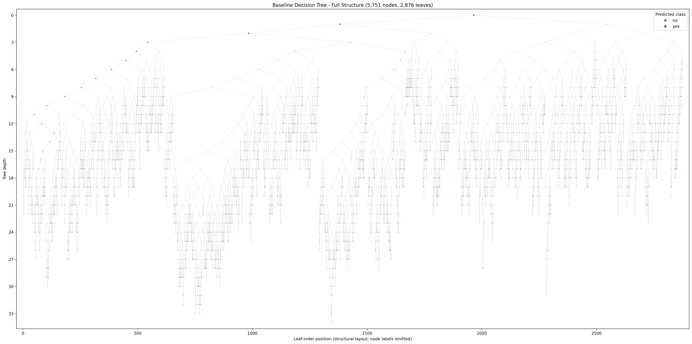
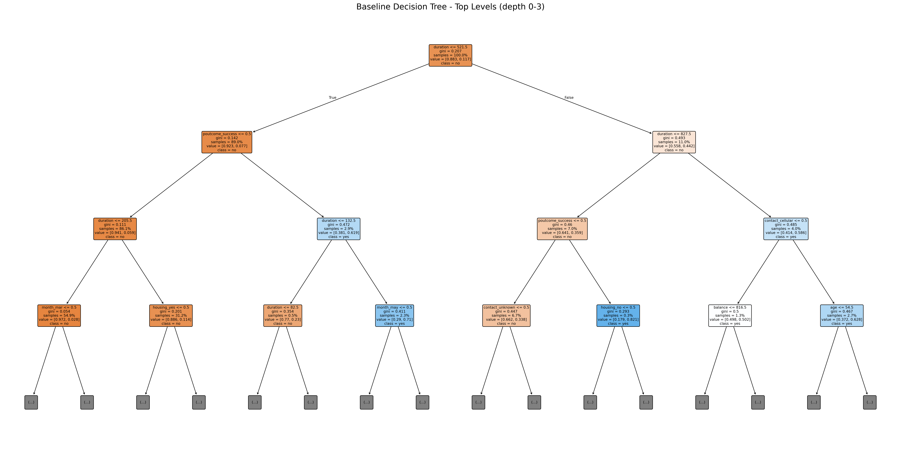
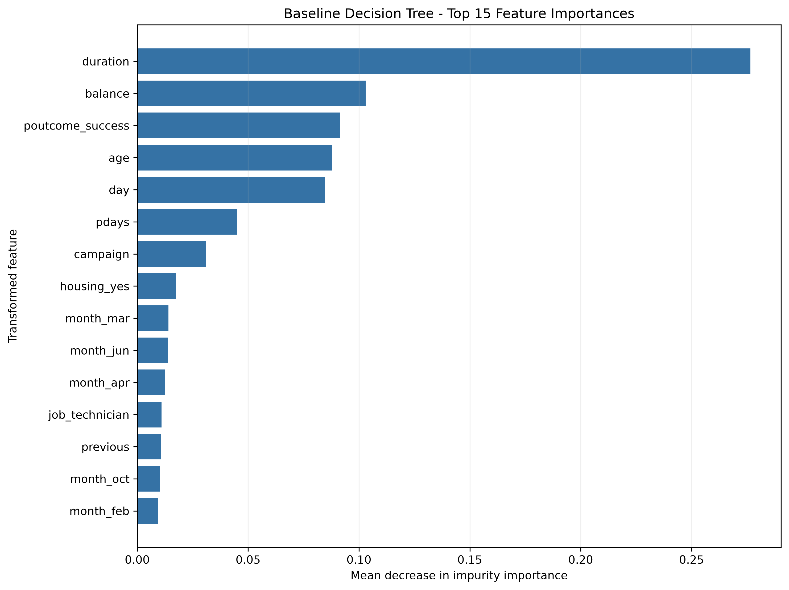

# Baseline Model

## Baseline Configuration

This section reports only Hoang's baseline Decision Tree and analysis. The source file was `data/bank-full.csv` with 45,211 observations, 16 raw predictors, and the binary target `y`. The positive class is `yes`, meaning that the client subscribed to a term deposit.

Hoang's baseline directly reuses Khang's shared data and preprocessing modules: `src.data.load_and_split_data()` performs a stratified 80%/20% train/test split with `random_state=42`, and `src.preprocessing.build_preprocessing_pipeline()` applies one-hot encoding to categorical predictors with numerical passthrough. The target is mapped as `no=0` and `yes=1`; report labels use the original class names. The encoder was fitted on the training partition only and produced 51 correctly named transformed features.

The true untuned baseline was `DecisionTreeClassifier` with the following exact configuration: `criterion='gini'`, `splitter='best'`, `max_depth=None`, `min_samples_split=2`, `min_samples_leaf=1`, `min_weight_fraction_leaf=0.0`, `max_features=None`, `random_state=42`, `max_leaf_nodes=None`, `min_impurity_decrease=0.0`, `class_weight=None`, `ccp_alpha=0.0`, `monotonic_cst=None`. No hyperparameter search, pruning, class weighting, or cross-validation tuning was performed.

## Baseline Evaluation

All evaluation values below were computed from the untouched held-out test partition. Precision, recall, and F1-score refer to positive class `yes`. ROC-AUC uses `predict_proba` scores for that class. Undefined metric divisions, if any, are assigned zero (`zero_division=0`); none of the displayed positive-class metrics required fabrication or imputation.

| Metric | Result |
| --- | ---: |
| Accuracy | 0.873714 |
| Error Rate | 0.126286 |
| Precision (`yes`) | 0.461111 |
| Recall (`yes`) | 0.470699 |
| F1-score (`yes`) | 0.465856 |
| ROC-AUC | 0.698906 |
| Training Accuracy | 1.000000 |
| Test Accuracy | 0.873714 |
| Train-Test Accuracy Gap | 0.126286 |

Accuracy is the overall fraction classified correctly. Precision measures how often predicted subscriptions were correct; recall measures how many actual subscriptions were detected; F1 balances precision and recall. ROC-AUC measures ranking discrimination across thresholds, while the error rate is the fraction classified incorrectly.

Because the held-out set is imbalanced, an always-`no` reference would achieve accuracy 0.883003. The baseline accuracy is 0.009289 lower than that reference. The always-majority rule would detect no positive subscriptions, whereas the fitted baseline identifies 498 true positives; therefore accuracy must be interpreted together with positive-class recall, F1-score, and the confusion matrix. This is evaluation context, not an additional improvement experiment.

## Confusion Matrix

The class order is `no`, `yes`. Therefore, the matrix is `[[7403, 582], [560, 498]]`: 7403 true negatives, 582 false positives, 560 false negatives, and 498 true positives. The horizontal axis is the predicted label and the vertical axis is the true label.

# Analysis of the Tree

## Tree Structure

The fitted baseline has depth **34**, **5,751 nodes**, and **2,876 leaves**. Its training accuracy is 1.000000, versus 0.873714 on the test set, a gap of 0.126286. The baseline shows strong evidence of overfitting: the unrestricted tree fits the training observations perfectly but generalizes substantially less accurately. This diagnosis describes the measured baseline and is not the result of tuning.

The full structural view contains every node, with colour indicating the node's predicted class. Labels are intentionally omitted at this scale. The following unchanged-model view displays the first levels with readable node labels; it is a presentation truncation, not a smaller retrained tree.

## Important Splits and Decision Rules

The root split uses `duration` at threshold 521.500000. The left branch represents **duration <= 521.500**, and the right branch represents **duration > 521.500**. The threshold is interpreted as numeric.

The internal splits through depth 2 are listed below. For a one-hot feature such as `poutcome_success`, a threshold of 0.5 separates rows without that category (left) from rows with that category (right).

| Depth | Branch path | Split feature | Threshold | Training rows at node | Node prediction |
| ---: | --- | --- | ---: | ---: | --- |
| 0 | `root` | `duration` | 521.500 | 36,168 | `no` |
| 1 | `rootL` | `poutcome_success` | 0.500 | 32,180 | `no` |
| 2 | `rootLL` | `duration` | 205.500 | 31,145 | `no` |
| 2 | `rootLR` | `duration` | 132.500 | 1,035 | `yes` |
| 1 | `rootR` | `duration` | 827.500 | 3,988 | `no` |
| 2 | `rootRL` | `poutcome_success` | 0.500 | 2,540 | `no` |
| 2 | `rootRR` | `contact_cellular` | 0.500 | 1,448 | `yes` |

Representative fitted leaf rules were selected programmatically for high support and moderate path length:

1. IF duration <= 521.500 AND poutcome is not 'success' AND duration <= 205.500 AND month is not 'mar' AND month is 'oct' AND duration <= 95.500 AND marital is not 'divorced', THEN predict **no** (training support = 76, purity = 1.000, path depth = 7).
2. IF duration <= 521.500 AND poutcome is 'success' AND duration <= 132.500 AND duration > 82.500 AND month is not 'sep' AND pdays > 102.500 AND balance > 247.500 AND month is not 'mar' AND age <= 61.000 AND month is not 'oct', THEN predict **no** (training support = 46, purity = 1.000, path depth = 10).
3. IF duration > 521.500 AND duration <= 827.500 AND poutcome is 'success' AND housing is 'no' AND day <= 30.500 AND job is not 'entrepreneur' AND day > 1.500 AND education is not 'unknown', THEN predict **yes** (training support = 55, purity = 1.000, path depth = 8).
4. IF duration > 521.500 AND duration > 827.500 AND contact is 'cellular' AND age <= 54.500 AND poutcome is 'success' AND day > 8.000, THEN predict **yes** (training support = 24, purity = 1.000, path depth = 6).

These rules describe associations learned by this fitted tree. They should not be interpreted as causal effects. The exact early-level tree text is saved in `../outputs/trees/early_tree.txt`, and the complete labeled tree is available in `../outputs/trees/baseline_tree_full.dot`.

## Feature Importance

The tree's impurity-based `feature_importances_` values were mapped one-to-one to fitted `ColumnTransformer.get_feature_names_out()` names.

| Rank | Feature | Importance |
| ---: | --- | ---: |
| 1 | `duration` | 0.276517 |
| 2 | `balance` | 0.103049 |
| 3 | `poutcome_success` | 0.091619 |
| 4 | `age` | 0.087798 |
| 5 | `day` | 0.084751 |
| 6 | `pdays` | 0.045028 |
| 7 | `campaign` | 0.030971 |
| 8 | `housing_yes` | 0.017515 |
| 9 | `month_mar` | 0.014057 |
| 10 | `month_jun` | 0.013801 |

An importance value is the normalized total impurity reduction attributed to a transformed feature. It indicates how much the fitted tree used that feature, but it does not establish causality and may favour variables offering many possible split points.

## Strengths of the Baseline Tree

- It represents nonlinear interactions without requiring feature scaling.
- Its fitted decisions can be inspected through explicit branches and leaf rules.
- It provides a reproducible reference result for the separately owned improvement experiments.

## Weaknesses of the Baseline Tree

- Its depth, leaf count, and measured train-test gap make the unrestricted baseline difficult to interpret in full and indicate poor generalization relative to its training fit.
- Its accuracy is below the always-majority reference on this imbalanced test set, and positive-class recall/F1 remain weak; accuracy alone would therefore be misleading.
- Impurity-based feature importance is model-specific and non-causal.
- The `duration` predictor is only known after a marketing call finishes. Its use is valid for reproducing the selected dataset baseline, but it would be unavailable for a pre-call targeting system and is therefore a deployment-time leakage concern, not a train/test leakage bug.

## Data-Leakage Audit

- Shared pipeline: `src.data + src.preprocessing`
- Split before preprocessor fit: `True`
- Preprocessor fit partition: `training only`
- Test partition usage: `transform and evaluation only`
- Target column: `y`
- Target excluded from raw partitions: `True`
- Target excluded from transformed features: `True`
- Train test indices disjoint: `True`
- Split row count: `45211`
- Feature name count: `51`
- Transformed train column count: `51`
- Transformed test column count: `51`
- Feature names aligned: `True`

The test partition was never supplied to model or preprocessing `fit`, and the target was removed before splitting predictors. No test result was used to tune this baseline. Khang's original train/test indices are fingerprinted in the shared manifest so every later experiment can verify direct comparability.
