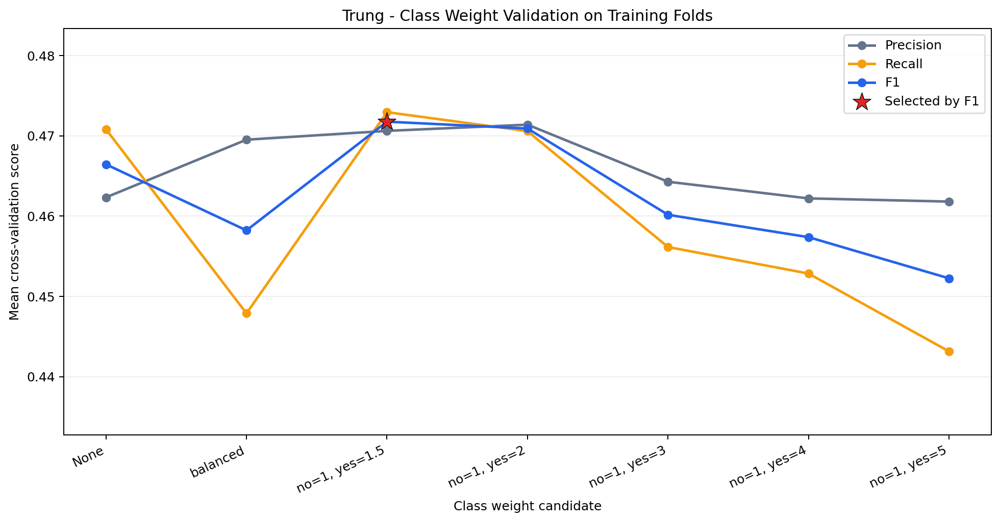
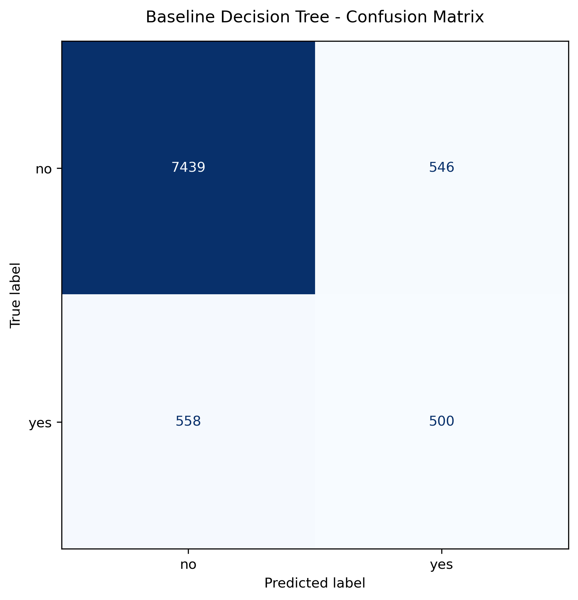
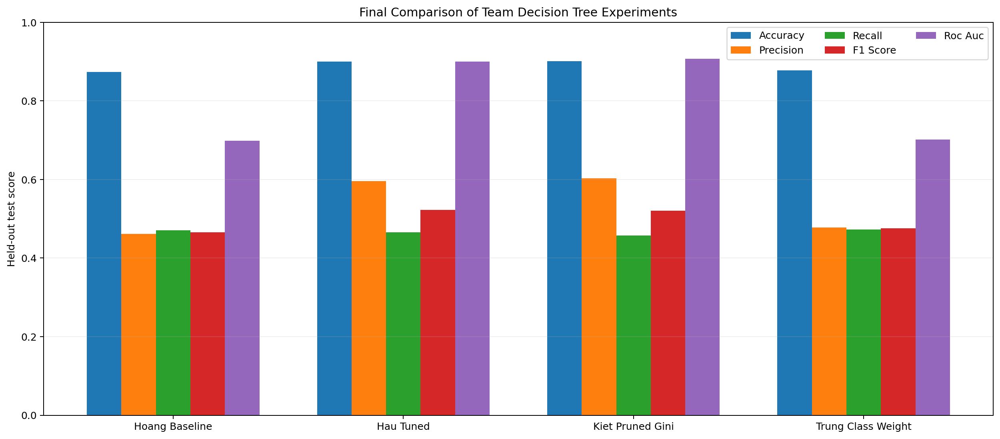

# Improvement Method 3 - Class Weight and Final Conclusion

## Mục tiêu

Phần này do **Trung** phụ trách. Dataset có lớp `yes` thiểu số, vì vậy Accuracy có thể che khuất việc mô hình bỏ sót khách hàng đăng ký tiền gửi. Thí nghiệm thay đổi duy nhất tham số `class_weight` của frozen baseline để tăng chi phí phân loại sai lớp `yes`.

## Thiết kế thí nghiệm

- Giữ nguyên dataset, target, stratified split 80/20 và `random_state=42` của nhóm.
- Preprocessing nằm trong pipeline và được fit riêng trong từng training fold.
- Chọn weight bằng F1 lớp `yes` trên stratified 5-fold cross-validation; khi bằng nhau ưu tiên Recall cao hơn.
- Tập test chính thức chỉ được dùng một lần sau khi weight đã được khóa.
- Weight được chọn: **`no=1, yes=1.5`**, mean CV F1 **0.471762**, mean CV Recall **0.472941**.

## Kết quả mô hình của Trung

| Metric | Result |
| --- | ---: |
| Accuracy | 0.877917 |
| Error Rate | 0.122083 |
| Precision (`yes`) | 0.478011 |
| Recall (`yes`) | 0.472590 |
| F1 (`yes`) | 0.475285 |
| ROC-AUC | 0.702106 |
| Depth | 34 |
| Leaves | 2,897 |
| Nodes | 5,793 |

## Comparison of Results

| Model | Accuracy | Precision yes | Recall yes | F1 yes | ROC-AUC | Depth | Leaves | Nodes |
| --- | ---: | ---: | ---: | ---: | ---: | ---: | ---: | ---: |
| Hoang Baseline | 0.873714 | 0.461111 | 0.470699 | 0.465856 | 0.698906 | 34 | 2,876 | 5,751 |
| Hau Tuned | 0.900476 | 0.595411 | 0.465974 | 0.522800 | 0.900540 | 20 | 339 | 677 |
| Kiet Pruned Gini | 0.901250 | 0.602740 | 0.457467 | 0.520150 | 0.907433 | 18 | 81 | 161 |
| Trung Class Weight | 0.877917 | 0.478011 | 0.472590 | 0.475285 | 0.702106 | 34 | 2,897 | 5,793 |

## Conclusion

So với frozen baseline, mô hình class-weight của Trung làm Recall lớp `yes` thay đổi +0.001890 và F1 thay đổi +0.009429. Class weighting hướng cây chú ý nhiều hơn tới lỗi false negative nhưng có thể đánh đổi Precision hoặc Accuracy; vì vậy mô hình phù hợp phải được chọn theo chi phí nghiệp vụ, không chỉ theo Accuracy.

Hậu cho thấy giới hạn cấu trúc có thể giảm overfitting, Kiệt cho thấy pruning giảm mạnh kích thước cây, còn Trung tập trung trực tiếp vào mất cân bằng lớp. Bảng trên dùng cùng test partition cho mọi mô hình, nhưng từng cấu hình đều được khóa bằng training-only validation trước khi xem test.
